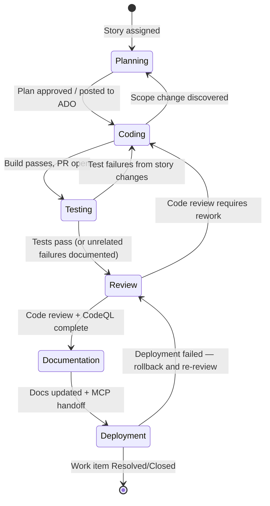

# Orchestration Contract

> **This file is authoritative for all future story processing unless explicitly superseded by the repository owner.**

AI coding agents working on this repository MUST follow the protocol defined here when executing user stories and keeping Azure DevOps in sync via MCP.

---

## Stage Order

Every user story flows through these stages in sequence:

```text
Planning → Coding → Testing → Review → Documentation → Deployment
```

Skipping a stage is only permitted with explicit repository-owner approval. Each stage gate must be satisfied before transitioning to the next.

---

## Deployment Ownership Boundary

- GitHub agent orchestrates **Planning through Documentation**.
- GitHub agent MUST **not** perform deployment directly.
- Azure Function Deployment agent owns merge/deploy policy execution based on autonomy level and review score policy.
- GitHub agent hands off by signaling **Deployment readiness** via MCP after Documentation is complete.

---

## Stage Definitions and MCP Update Protocol

### Stage 1 — Planning

**Entry trigger:** Story assigned to agent or `@copilot` mentioned on issue.

**Actions:**
1. Read `.agent/ORCHESTRATION_CONTRACT.md` first.
2. Read other relevant `.agent/*` docs needed for this story.
3. Read issue description, acceptance criteria, and all comments.
4. Explore the codebase using repository search and targeted file reads (using tools available in the current environment).
5. Perform a **Story Readiness Review**:
   - Identify blockers, missing info, TBD/Need-to-Decide items, and dependency gaps.
   - Generate all questions that should be answered before safe implementation.
   - Produce a **Story Readiness Score (0-100)**.
6. Compare readiness score to `AI Minimum Review Score` from the work item.
7. If score is below threshold: send story to `Needs Revision` with full question list.
8. If score meets/exceeds threshold: proceed, and document assumptions/choices made for unresolved items.
9. Produce a written implementation plan (checklist) covering files to change, tests, and risks.

**Required MCP calls at stage completion (score below threshold):**
- `set_work_item_state` → state: `Needs Revision`
- `add_work_item_comment` → body: readiness score, blockers, required questions, and why story is not ready
- `add_stage_event` → stage: `Planning`, status: `Completed`, evidence: readiness assessment + question list

**Required MCP calls at stage completion (score meets/exceeds threshold):**
- `set_work_item_state` → state: `Active`
- `add_work_item_comment` → body: plan checklist + readiness score + questions identified + assumptions/choices used
- `add_stage_event` → stage: `Planning`, status: `Completed`, evidence: plan + readiness assessment

**Evidence required:** Plan checklist, readiness score, explicit question list, and assumptions/choices log.

---

### Stage 2 — Coding

**Entry trigger:** Planning stage completed with plan posted as ADO comment.

**Actions:**
1. Call `report_progress` with initial checklist (creates/updates PR).
2. Make targeted, minimal code changes.
3. Run linters and build to verify no regressions.
4. Push changes via `report_progress` after each meaningful unit of work.

**Required MCP calls at stage completion:**
- `add_work_item_comment` → body: summary of changes made, PR link
- `link_work_item_to_pull_request` → link the PR to the ADO work item
- `add_stage_event` → stage: `Coding`, status: `Completed`, evidence: PR link + diff summary

**Evidence required:** PR link, list of changed files, build success confirmation.

**Idempotency:** All `report_progress` calls are idempotent — re-running after a failure will only push uncommitted changes.

---

### Stage 3 — Testing

**Entry trigger:** Coding stage completed, PR open.

**Actions:**
1. Run existing test suite targeting changed areas:
   - DNN backend: `dotnet test src/MCP.Core.Tests/MCP.Core.Tests.csproj`
   - Portal: `cd src/MCP.Portal && npm run type-check && npm run lint`
2. Add focused tests for new behaviour (consistent with existing test patterns).
3. Verify no previously-passing tests are broken.
4. Capture test results (pass/fail counts).

**Required MCP calls at stage completion:**
- `add_work_item_comment` → body: test results summary (tests run, passed, failed, skipped)
- `add_stage_event` → stage: `Testing`, status: `Completed`, evidence: test result output

**Evidence required:** Test execution output showing pass/fail counts and zero regressions.

**Failure handling:** If tests fail on issues unrelated to the story, document them in the ADO comment and proceed. Only block on failures caused by story changes.

---

### Stage 4 — Review

**Entry trigger:** Testing stage completed.

**Actions:**
1. Call `code_review` tool to request automated code review.
2. Address all valid feedback from code review.
3. Call `codeql_checker` tool for security analysis.
4. Fix any security issues surfaced by CodeQL.
5. Re-run `code_review` if significant changes were made after review.

**Required MCP calls at stage completion:**
- `add_work_item_comment` → body: review outcome, issues addressed, security summary
- `add_stage_event` → stage: `Review`, status: `Completed`, evidence: review outcome + security summary

**Evidence required:** Code review completed, CodeQL scan run, and security summary (even if "no issues found").

**Retry handling:** If `codeql_checker` surfaces unfixable issues, document them with justification in the ADO security summary comment.

---

### Stage 5 — Documentation

**Entry trigger:** Review stage completed with all feedback addressed.

**Actions:**
1. Update `.agent/` documentation files if the story introduced new patterns, endpoints, or architectural decisions.
2. Update `metadata.json` with new `lastAnalysis` timestamp and updated counts if documentation was added.
3. Update inline code comments where complexity warrants explanation.
4. Update `AGENTS.md` if security rules or payment flows were changed.
5. Ensure the PR is **Ready for Review** (not draft) before handoff.

**Required MCP calls at stage completion:**
- `add_work_item_comment` → body: list of documentation files created/updated (or explicit "no documentation changes required")
- `add_stage_event` → stage: `Documentation`, status: `Completed`, evidence: list of doc files
- `set_stage` (or equivalent MCP stage transition) → stage: `Deployment`

**Evidence required:** List of documentation files created or updated (or explicit no-doc-change statement) and Deployment stage handoff signal.

---

### Stage 6 — Deployment

**Entry trigger:** Documentation stage completed and Deployment stage signaled via MCP.

**Actions:**
1. Ensure PR targets the correct branch (`feature/US-{ticket}` or `dev` for DNN, `stage`/`main` for portal via Vercel).
2. For DNN backend changes: notify lead developer to perform manual deployment after PR merge.
3. For Portal changes: confirm Vercel auto-deployment triggered on merge to `stage` or `main`.
4. Verify deployment succeeded (Vercel dashboard or lead developer confirmation).

**Required MCP calls at stage completion:**
- `set_work_item_state` → state: `Resolved` (or `Closed` if no further validation needed)
- `add_work_item_comment` → body: deployment result, environment deployed to, any post-deploy validation steps
- `add_stage_event` → stage: `Deployment`, status: `Completed`, evidence: deployment confirmation

**Evidence required:** Deployment confirmation (Vercel build URL, or lead developer sign-off for DNN).

---

## Story Readiness Scoring Protocol (Planning Gate)

This repository uses `AI Minimum Review Score` as a **Planning readiness threshold**.

`AI Autonomy Level` may appear as either numeric values or text labels and must be treated equivalently:
- `1` / `Plan Only`
- `2` / `Code Only`
- `3` / `Review & Pause`
- `4` / `Auto-Merge`
- `5` / `Full Autonomy`

### Score range
- Integer from `0` to `100`.

### Rubric (total 100)
- Requirement clarity/completeness: **30**
- Acceptance criteria testability: **20**
- Technical feasibility/dependency clarity: **20**
- Risk/unknowns resolution readiness: **20**
- Scope specificity (low ambiguity/TBD): **10**

### Decision rule
1. Read story field: `AI Minimum Review Score`.
2. Compute `Story Readiness Score`.
3. If `Story Readiness Score < AI Minimum Review Score`:
   - Move work item to `Needs Revision`
   - Post one consolidated `Needs Revision` comment with all blockers, missing details, and clarifying questions
   - Do not start Coding
4. If autonomy is level `1` (`Plan Only`):
   - Perform a full deep analysis of the entire story (description, acceptance criteria, comments, dependencies) before deciding readiness
   - Do not implement code changes
   - Post one consolidated `Needs Revision` comment with all blocking questions and a brief proposed plan (3-5 bullets)
   - If no blockers remain after analysis, include the exact line: `No further info needed.` before presenting your brief proposed plan.
   - Move work item to `Needs Revision`
5. If score meets/exceeds minimum and Autonomy Level > 1:
   - Continue to Coding
   - Post questions discovered and assumptions/choices used to proceed

### ADO Board Priority Rule (non-negotiable)
1. **Job #1:** Keep Azure DevOps board and fields up to date (`System.State`, `Custom.CurrentAIAgent`, `Custom.LastAgent`, stage evidence comments/events).
2. **Job #2:** Perform planning/coding/review work.
3. **Completion protocol:** **No task is complete until you set ADO fields/state and add completion comment, then re-read and print final values.**
4. For completion comments, use readable markdown sections and bullets:
   - `## Outcome`
   - `## ADO Updates Applied`
   - `## Evidence`
   - `## Final ADO Values` (state + agent fields after re-read)

---

## Copilot Completion Gate (Done Criteria Before Handoff)

A Copilot-orchestrated run is considered ready for Deployment handoff only when all are true:

1. PR is **not draft** (Ready for Review)
2. PR title is not `[WIP]`
3. PR has at least one changed file
4. Documentation stage MCP updates are posted
5. Deployment readiness stage signal is sent via MCP

If any are missing, do not hand off to Deployment.

---

## State Transition Rules



### Allowed Backwards Transitions

| From | To | Condition |
|------|-----|-----------|
| Coding | Planning | Significant scope or approach change discovered |
| Testing | Coding | Failures directly caused by story changes |
| Review | Coding | Code review feedback requires meaningful rework |
| Deployment | Review | Deployment failure requires code fix |

---

## Idempotency Requirements

- Every `add_stage_event` call MUST include a stable `idempotencyKey` constructed as: `{workItemId}-{stage}-{YYYY-MM-DD}` (e.g., `124-Planning-2026-03-01`).
- Duplicate event submissions with the same key are safe and will be de-duplicated by the MCP server.
- `link_work_item_to_pull_request` is idempotent — safe to call multiple times for the same PR.
- Re-running completion calls must not duplicate destructive actions.

---

## Branch and PR Conventions

| Story type | Base branch | PR target | Auto-deploy |
|------------|------------|-----------|-------------|
| Feature (DNN) | `dev` | `dev` | No |
| Feature (Portal) | `dev` | `stage` | Yes (Vercel) |
| Hotfix | `main` | `main` | After manual review |

Branch naming follows `feature/{initials}/{feature-name}` (e.g., `feature/jp/add-payment-api`). AI agents use `copilot/{short-description}` as an equivalent convention when no initials are available.

---

## ADO Work Item State Map

| ADO State | Meaning |
|-----------|---------|
| `New` | Story created, not yet started |
| `Active` | Agent has started — set at Planning stage entry |
| `In Review` | PR open, review in progress |
| `Needs Revision` | Story not ready or blocked by planning/readiness gate |
| `Resolved` | Story complete, deployed or ready for validation |
| `Closed` | Validated and signed off |

---

## Security Guardrails (non-negotiable)

These rules from `AGENTS.md` apply at every stage:

1. **Never trust client amount fields for signup payments** — server uses `SignupSessionId` exclusively.
2. **Never commit secrets** — API keys, JWT secrets, connection strings must never appear in source files.
3. **Always use parameterized SQL queries** — never string concatenation in data access code.
4. **FCRA compliance** — all credit data access must be audit-logged via `HistoryLogic.createHistoryItem()`.
5. **Never bypass `PaymentController` validation** for signup or invoice-linked flows.

Any story whose implementation would violate these rules must be escalated to the repository owner before proceeding.

---

## Quick Reference: MCP Call Sequence per Stage

```text
Planning complete   → readiness review + score + questions; if below threshold set Needs Revision, else set Active + add_comment(plan + assumptions) + add_stage_event(Planning/Completed)
Coding complete     → add_comment(PR link + diff) + link_PR + add_stage_event(Coding/Completed)
Testing complete    → add_comment(test results) + add_stage_event(Testing/Completed)
Review complete     → add_comment(review + security) + add_stage_event(Review/Completed)
Documentation done  → add_comment(doc changes) + add_stage_event(Documentation/Completed) + set_stage(Deployment)
Deployment done     → set_work_item_state(Resolved) + add_comment(deploy result) + add_stage_event(Deployment/Completed)
```
